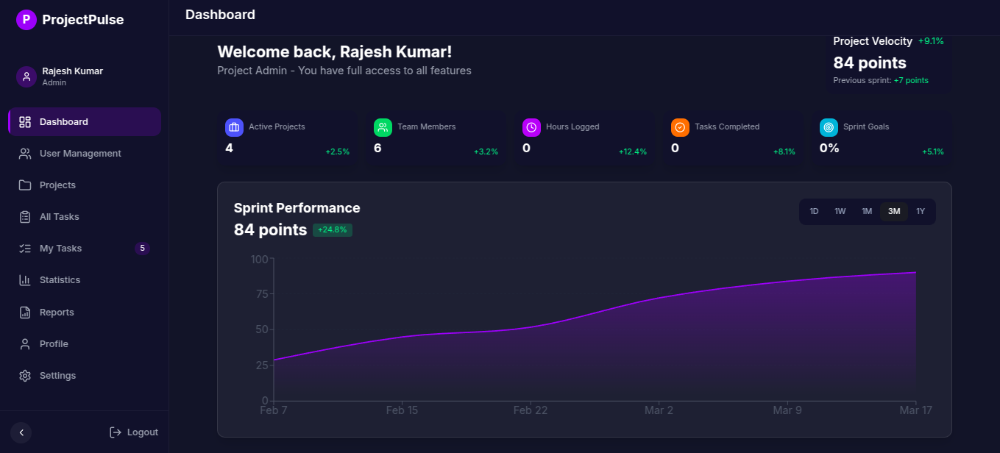

# Prolumina - Project Management System

A modern, feature-rich project management system built with React 18, TypeScript, and Supabase. Designed for teams to collaborate effectively with a beautiful UI powered by ShadCN and Tailwind CSS.



## 📚 Table of Contents
- [Features](#features)
- [Technology Stack](#technology-stack)
- [Getting Started](#getting-started)
- [Database Setup](#database-setup)
- [Development](#development)
- [Deployment](#deployment)
- [Troubleshooting](#troubleshooting)
- [Contributing](#contributing)
- [License](#license)

## ✨ Features

- **Modern Authentication**: Secure user authentication with Supabase Auth
- **Role-Based Access**: Multiple user roles (admin, team, client) with granular permissions
- **Interactive Dashboard**: Real-time project statistics and progress tracking
- **Task Management**: Create, assign, and track tasks with status updates
- **Team Collaboration**: Efficient team member assignment and management
- **Activity Tracking**: Comprehensive logging of all user actions
- **Data Visualization**: Beautiful charts and graphs using Recharts
- **Responsive Design**: Mobile-first approach with adaptive layouts
- **Dark Mode Support**: Built-in theme switching capability

## 🛠 Technology Stack

### Frontend
- **Core**: React 18.3 + TypeScript 5.5
- **Build Tool**: Vite 5.4
- **UI Framework**: ShadCN UI + Tailwind CSS 3.4
- **State Management**: 
  - Zustand 5.0 (App State)
  - TanStack Query 5.56 (Server State)
- **Form Handling**: React Hook Form 7.53 + Zod validation
- **Routing**: React Router 6.26
- **Data Visualization**: Recharts 2.12
- **Animations**: Framer Motion 12.6
- **Date Handling**: date-fns 4.1
- **UI Components**: 
  - Radix UI Primitives
  - Embla Carousel
  - Command Menu (cmdk)
  - Sonner Toasts

### Backend
- **Platform**: Supabase (Backend as a Service)
- **Database**: PostgreSQL with Row Level Security
- **API**: Supabase Client SDK 2.49
- **Authentication**: JWT-based auth

## 🚀 Getting Started

### Prerequisites
- Node.js (v18 or higher recommended)
- npm or yarn
- Git

### Installation Steps

1. Clone the repository
```bash
git clone https://github.com/yourusername/prolumina.git
cd prolumina
```

2. Install dependencies
```bash
npm install
```

3. Set up environment variables
```bash
cp .env.example .env.local
```

4. Configure your environment variables in `.env.local`:
```bash
VITE_SUPABASE_URL=your_project_url
VITE_SUPABASE_ANON_KEY=your_anon_key
```

5. Start the development server
```bash
npm run dev
```

## 🗄️ Database Setup

### Supabase Setup Steps

1. Create a new project on [Supabase](https://supabase.com)
2. Set up database schema:
   ```bash
   # Run these scripts in Supabase SQL Editor
   1. src/lib/schema.sql      # Database structure
   2. src/lib/seedDatabase.sql # Sample data
   ```

### Required Database Tables
- Users (auth and profiles)
- Projects
- Tasks
- Activity Logs
- Project Members
- Task Comments
- Task Assignees

### Security Configuration

The project uses Row Level Security (RLS) policies for data protection. Example policy:

```sql
-- Projects table RLS
CREATE POLICY "Users can view their assigned projects"
ON public.projects
FOR SELECT
USING (
  auth.uid() IN (
    SELECT user_id FROM project_members 
    WHERE project_id = id
  )
);
```

## 💻 Development

### Project Structure
```
src/
├── components/    # Reusable UI components
│   ├── auth/     # Authentication components
│   ├── dashboard/# Dashboard-specific components
│   ├── projects/ # Project management components
│   ├── tasks/    # Task management components
│   └── ui/       # Shared UI components
├── hooks/        # Custom React hooks
├── lib/          # Utilities & configurations
├── pages/        # Route components
├── stores/       # Zustand store definitions
├── types/        # TypeScript type definitions
└── utils/        # Helper functions
```

### Available Scripts
- `npm run dev` - Start development server
- `npm run build` - Create production build
- `npm run build:dev` - Create development build
- `npm run preview` - Preview production build
- `npm run lint` - Run ESLint checks

## 🌐 Deployment

1. Build the application
```bash
npm run build
```

2. Deploy using your preferred platform:
   - Vercel (recommended)
   - Netlify
   - AWS Amplify
   - Docker container

## 🔧 Troubleshooting

### Common Issues

1. **Authentication Issues**
   - Verify Supabase URL and Anon Key
   - Check browser console for JWT errors
   - Ensure email confirmation is handled

2. **Database Access Problems**
   - Verify RLS policies
   - Check user roles and permissions
   - Confirm database connection string

3. **Build Issues**
   - Clear node_modules and reinstall
   - Update Node.js version
   - Check TypeScript compatibility

## 🤝 Contributing

1. Fork the repository
2. Create a feature branch (`git checkout -b feature/amazing-feature`)
3. Commit your changes (`git commit -m 'Add amazing feature'`)
4. Push to the branch (`git push origin feature/amazing-feature`)
5. Open a Pull Request

### Development Guidelines
- Follow TypeScript best practices
- Write tests for new features
- Update documentation
- Follow the existing code style

## 📄 License

This project is licensed under the MIT License - see the [LICENSE](LICENSE) file for details.

---

Built with ❤️ using React, TypeScript, and Supabase
