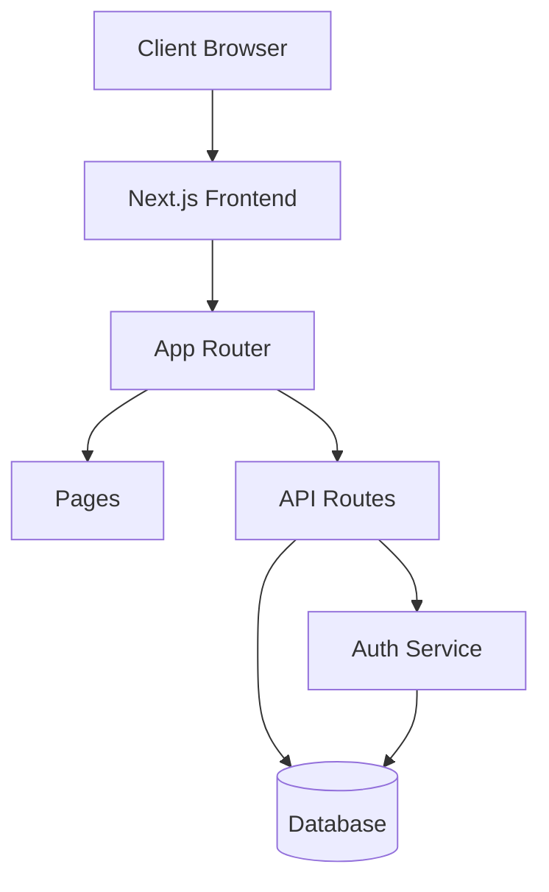
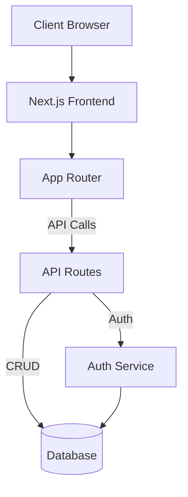
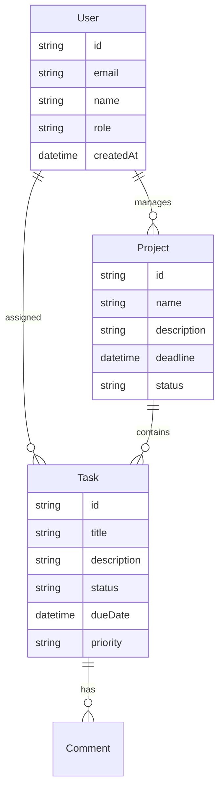
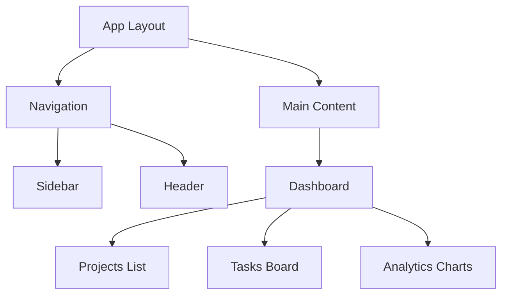
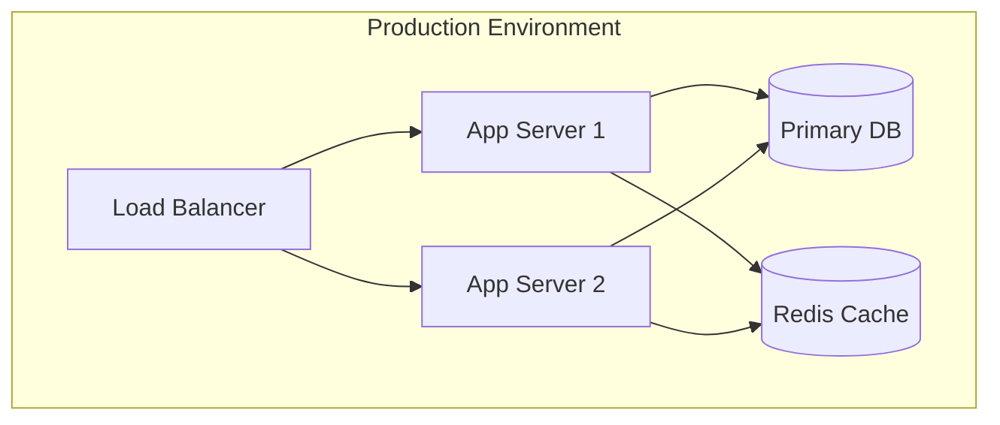
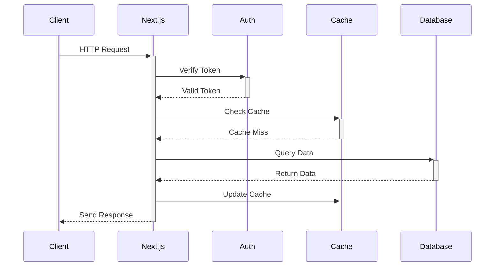
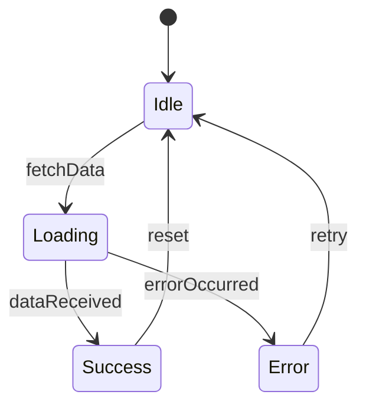

# Design Diagrams

## System Architecture

## System Architecture Diagram

## Database Schema

## Component Architecture

## Deployment Architecture

## Data Flow Diagram

## State Management Flow

